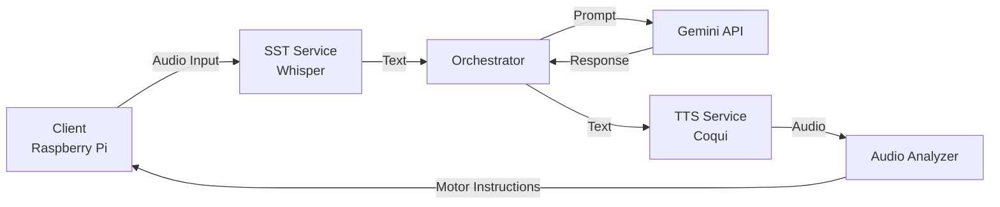

# A Fish Called Billy 🐟

A multi-service application that processes audio through speech recognition, AI conversation, and text-to-speech synthesis, complete with motor control instructions for animatronic movement.

## Project Overview

This project consists of a client-server architecture where:
- The server runs multiple Docker-based microservices for audio processing
- The client runs on a Raspberry Pi for audio input/output and animatronic control
- The system processes audio through multiple stages:
  1. Speech-to-Text (Whisper)
  2. AI Response Generation (Google Gemini)
  3. Text-to-Speech (Coqui)
  4. Audio Analysis for Motor Control

## System Requirements

### Server (PC)
- Docker and Docker Compose
- 4GB RAM minimum
- 10GB free disk space
- Internet connection for Google Gemini API

### Client (Raspberry Pi)
- Raspberry Pi 3 or newer
- Microphone
- Speaker
- GPIO pins for motor control
- Python 3.8+

## Installation & Setup

### Server Setup

1. Clone the repository
2. Navigate to the server directory:
   ```bash
   cd server/docker
   ```
3. Copy the environment template:
   ```bash
   cp .env.example .env
   ```
4. Configure environment variables in `.env`:
   ```
   GOOGLE_API_KEY=your-google-api-key-here
   SST_URL=http://localhost:5001/inference
   TTS_URL=http://localhost:5003/api/tts
   ANALYZER_URL=http://localhost:5004/analyze
   ```
5. Start the Docker services:
   ```bash
   docker-compose up -d
   ```

### Client Setup (Raspberry Pi)

1. Navigate to the client directory:
   ```bash
   cd client
   ```
2. Install dependencies:
   ```bash
   pip install -r requirements.txt
   ```
3. Configure the client settings (service URLs will match your server's IP address)

## Running the Application

### Starting the Server Services

The server runs four main services:

1. Speech-to-Text (Whisper)
   - Port: 5001
   - Handles audio transcription

2. Text-to-Speech (Coqui)
   - Port: 5003
   - Generates speech from text

3. Audio Analyzer
   - Port: 5004
   - Processes audio for motor control

4. Orchestrator
   - Manages the processing pipeline
   - Coordinates between services

Monitor service status:
```bash
docker-compose ps
```

View logs:
```bash
docker-compose logs -f
```

### Starting the Client

Run the client application on the Raspberry Pi:
```bash
python src/app.js
```

## System Architecture



### Service Overview

- **SST Service (Whisper)**
  - Converts speech to text
  - Uses GGML base model
  - Supports multiple languages

- **Orchestrator**
  - Manages the processing pipeline
  - Handles API communication
  - Error handling and logging

- **TTS Service (Coqui)**
  - Converts text to speech
  - Uses VITS model
  - Configurable voice options

- **Audio Analyzer**
  - Processes audio for motor control
  - Generates timing instructions
  - Outputs JSON control data

### Communication Flow

1. Client sends audio to SST service
2. Transcribed text is processed by Orchestrator
3. Gemini API generates response
4. Response is converted to speech by TTS
5. Audio is analyzed for motor control
